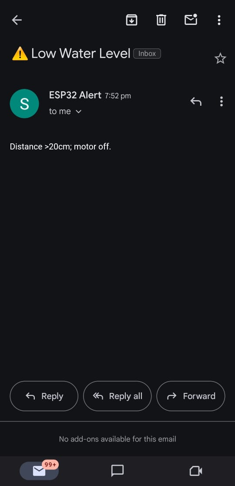

# IoT_Project

IoT-Based Smart Water Motor Controller with Email Alerts
This project is a prototype model designed to automate and protect household water pumps using IoT-based technology. It uses an ultrasonic or UV sensor to monitor the water level and automatically controls a submersible motor through a relay module, ensuring efficient water management and motor safety. When abnormal water levels are detected, the system sends an email alert to the user instead of using a buzzer.

Components Used
ESP32 Development Board (or NodeMCU ESP8266)

Ultrasonic Sensor (or UV Sensor for demo)

5V Relay Module

Submersible Water Pump (5V DC for prototype)

Jumper Wires, Breadboard

Power Supply (External 5V or USB)

Working Principle
The Ultrasonic Sensor detects the water level inside a tank or container.

The ESP32 continuously reads this sensor data.

If the water level goes below a threshold, the ESP32:

Turns off the motor via the Relay Module.

Sends an email alert to the user using SMTP or a cloud service like IFTTT.

Once the water level is restored, the system can re-enable the motor and stop alerting.

This provides automatic dry-run protection, preventing damage to the pump and saving electricity and water.

Circuit Diagram

A schematic showing ESP32, relay, ultrasonic sensor, and pump connections.

Open the Arduino IDE.

Install the ESP32 board package via Boards Manager.

Install the required libraries for WiFi and email sending (e.g., ESP Mail Client or IFTTT Webhooks).

Upload the .ino file to your ESP32.

Connect all components as per the diagram.

Power on your system. When water level is low:

The motor turns off.

An email alert is sent to the configured user email.

Features:

✔️ Automated water motor control

✔️ Email alerts for low water level

✔️ Dry run protection

✔️ Low-cost and energy-efficient

✔️ Can be expanded to cloud monitoring

Check out the main source file: [main.cpp](main.cpp)
